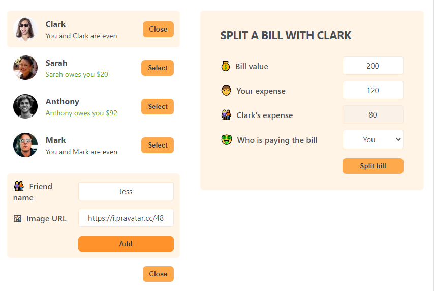

# Eat'n Split

React app which allows user to enter a restaurant bill, enter your expense of the bill, mark who paid for the bill, and then split the bill. A list of friends keeps track of how much is owed between you and each friend. A form allows you to add friends to the list.

In this app, I got a lot of practice with state, derived state, controlled forms, conditional rendering, event handlers, lifting state, and more.

  

